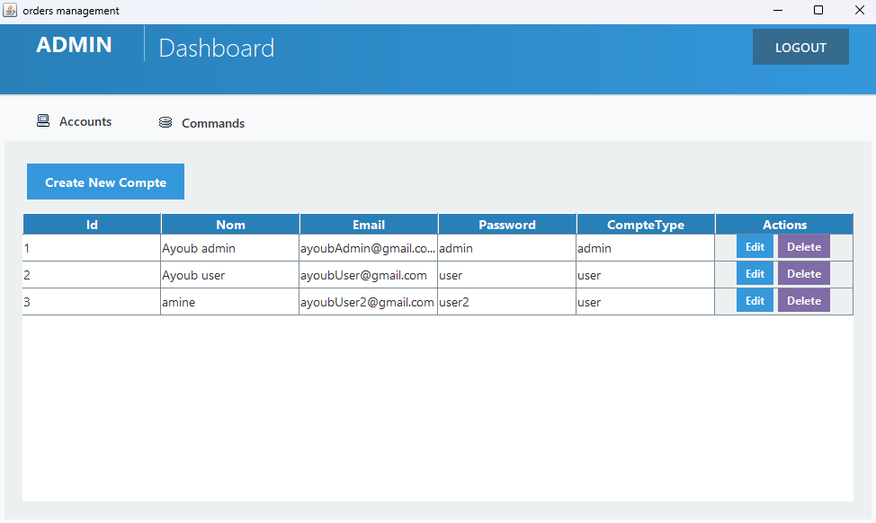

# 📦 Gestion_Des_Commandes_Java_Project_4iir - Readme

## Project Overview

### Main Interface



- 🔗 [Linkedin post](https://www.linkedin.com/posts/youbista_java-swing-jdbc-activity-7315219462033453056-Jxw9?utm_source=share&utm_medium=member_desktop&rcm=ACoAADvjKzABpK_MLZWJYvsh4MHCymLEb8DcykI)

This project is a **Client and Order Management System** designed to allow efficient tracking and handling of clients and orders. Developed in **Java** with a **Swing-based GUI**, it connects to a **MySQL** database using **JDBC**, supporting essential CRUD operations with an intuitive interface.

---

## 👤 Team Members

- [Ayoub Majid](https://www.linkedin.com/in/youbista/)
- [Salma Ben Yamna](https://www.linkedin.com/in/salma-ben-yamna-860256250/)

---

## 🎯 Objectives

- Master Java Swing for GUI development.
- Learn database connectivity using JDBC.
- Apply MVC principles in a real-world mini project.
- Implement full CRUD operations on clients and orders.

---

## 🛠 Technologies Used

- **Language**: Java
- **Database**: MySQL
- **Connectivity**: JDBC
- **Interface**: Java Swing
- **IDE**: IntelliJ / Eclipse

---

## 🧩 Database Structure

### Tables Used:

#### 📑 Commande

- `id` (Primary Key)
- date
- montant
- id_compte (Foreign Key)

#### 👤 Compte

- `id` (Primary Key)
- nom
- email
- compte_type
- password

#### 👤 Compte

```sql
CREATE TABLE Compte (
    id INT AUTO_INCREMENT PRIMARY KEY,
    nom VARCHAR(100) NOT NULL,
    email VARCHAR(100) NOT NULL,
    compteType VARCHAR(50) NOT NULL,
    password VARCHAR(100) NOT NULL UNIQUE,
    CONSTRAINT chk_compteType CHECK (compteType IN ('admin', 'user'))
);
```
#### 📑 Commande

```sql
CREATE TABLE Commande (
    id INT AUTO_INCREMENT PRIMARY KEY,
    date DATE NOT NULL,
    montant DECIMAL(10, 2) NOT NULL,
    id_Compte INT NOT NULL,
    FOREIGN KEY (id_Compte) REFERENCES Compte(id),
    CONSTRAINT check_montant_positive CHECK (montant > 0)
);

```
